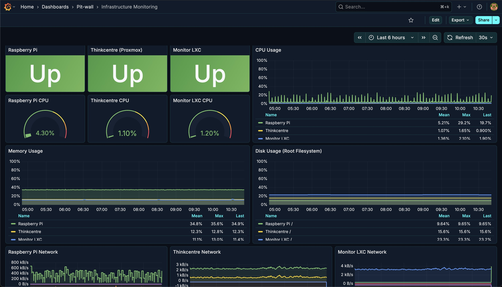
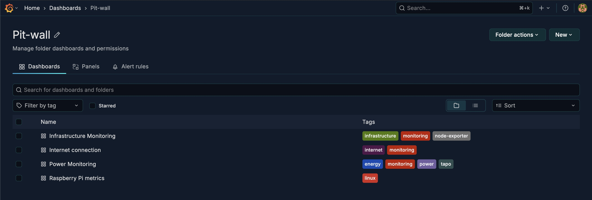
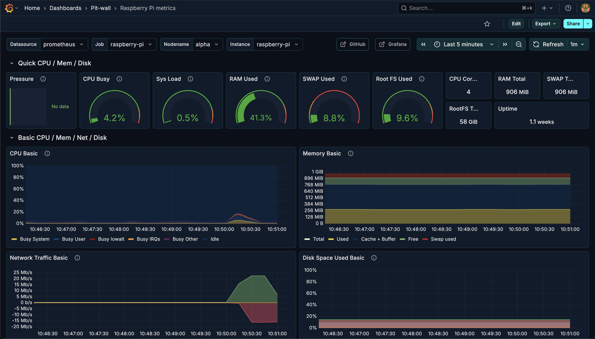
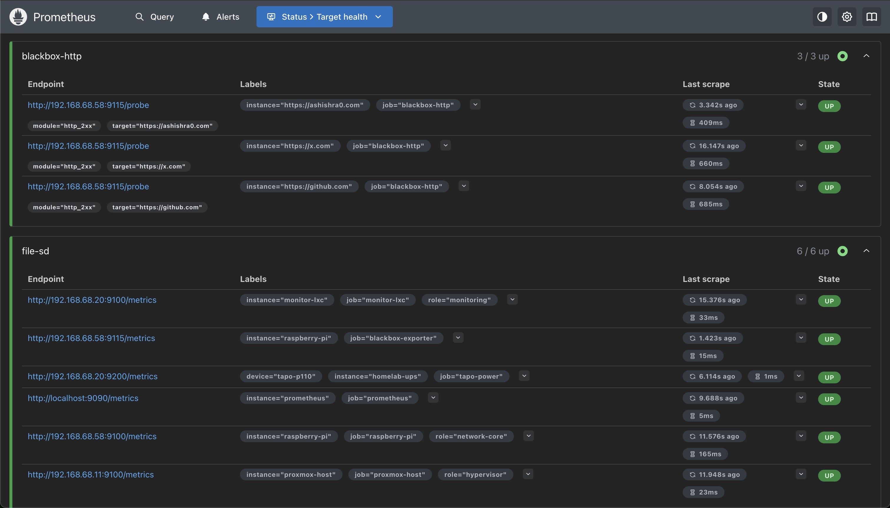

# Pit-Wall: Homelab Observability Stack

Ansible-driven homelab infrastructure with monitoring.

## Architecture

### Local Infrastructure
- **Raspberry Pi** (192.168.68.58): Pi-hole DNS + Internet monitoring
- **Proxmox Host** (192.168.68.10): Virtualization host
- **Monitor LXC** (192.168.68.20): Prometheus + Grafana
- **Power LXC** (192.168.68.12): Tapo power monitoring
- **NAS** (192.168.68.12): ZFS storage (future)

### External Infrastructure
- **Hetzner VPS** (46.225.68.103): External server monitoring via Tailscale VPN

## Quick Start

```bash
# Test connectivity
ansible all -m ping

# Configure Raspberry Pi
ansible-playbook playbooks/raspberry-pi.yaml

# Deploy monitoring stack
ansible-playbook playbooks/monitoring-stack.yaml

# Deploy power monitoring
ansible-playbook playbooks/power-monitoring.yaml

# Setup external server monitoring (Hetzner VPS via Tailscale)
# 1. Get Tailscale auth key from: https://login.tailscale.com/admin/settings/keys
# 2. Export the key: export TAILSCALE_AUTH_KEY="tskey-auth-xxxxx"
# 3. Run the setup:
ansible-playbook playbooks/setup-hetzner-monitoring.yaml
```

## Access

- Grafana: http://grafana.pit-wall.local:3000
- Prometheus: http://prometheus.pit-wall.local:9090
- Pi-hole: http://pihole.pit-wall.local/admin

## Screenshots

See [docs/screenshots](docs/screenshots) for visual examples of the monitoring setup:

### Grafana Dashboards

**Infrastructure Monitoring Dashboard**


**Pit-wall Dashboards Folder**


**Raspberry Pi Metrics Dashboard**


### Prometheus

**Target Health Status**


## Status

- [x] Ansible control plane setup
- [x] Pi-hole + DNS configuration
- [x] Monitoring stack deployment
- [x] Power monitoring
- [x] External server monitoring (Tailscale VPN)
- [x] Dashboards
